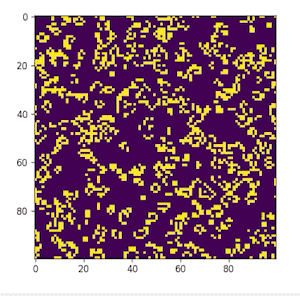

# Game of Life 

An Implementation of John Conway's Game of Life in Python  

## How to Run 

1. Clone the repository 
2. Install and use a virtual environment 
3. Install the dependencies 
4. Run the `game_of_life.py` script 

## Dependencies 

- numpy 
- matplotlib

## Alternatively install from req.txt by running 
`pip install -r requirements.txt`
